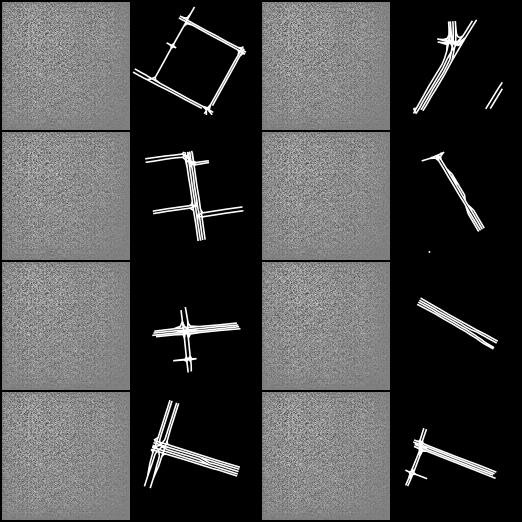
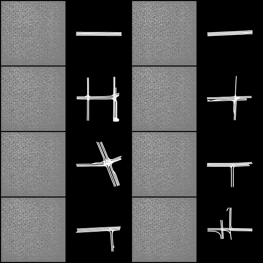
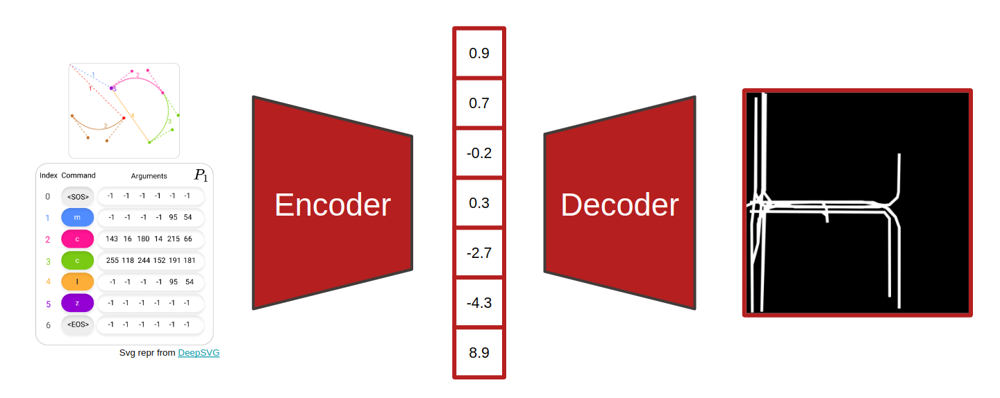
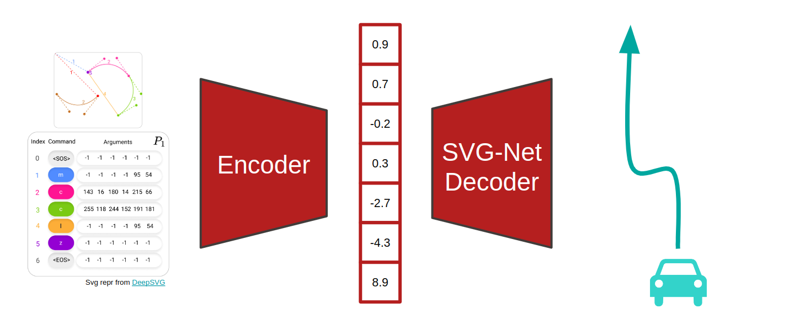
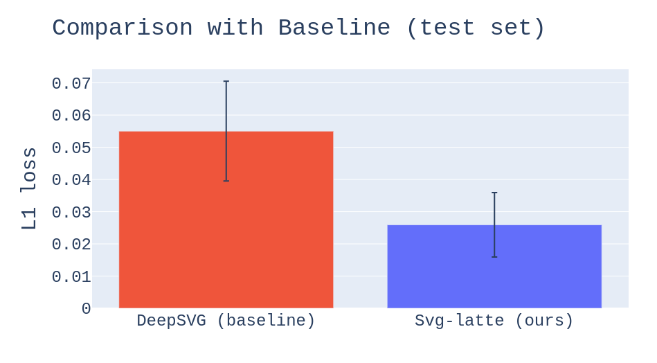

# Svg-latte: Latent representation for SVGs

[](https://www.python.org/downloads/release/python-390/)
[](https://github.com/m43/svg-latte/blob/master/LICENSE)

[//]: # (<div style="margin-left: auto;)

[//]: # (            margin-right: auto;)

[//]: # (            width: 90%">)

[//]: # ()

|                  Train progress over time                  |         Validation over time         |
|:----------------------------------------------------------:|:------------------------------------:|
| [](http://videoblocks.com) | [](aa) |

[//]: # ()

[//]: # (</div>)

Vector graphics contain much more information compared to raster images. To profit from the additional information, we want to create a useful latent representation that can be used in downstream tasks. We explore latent representations of a simple encoder-decoder architecture, called Svg-latte, supervised by image reconstruction loss. Svg-latte outperforms DeepSVG, which is used as a baseline, in L1 image reconstruction. To investigate the usefulness of the latent representation in downstream tasks, we plug a pre-trained Svg-latte encoder into the trajectory prediction model [SVG-Net](https://github.com/vita-epfl/SVGNet). Even though Svg-latte outperformed DeepSVG in image reconstruction quality, replacing the DeepSVG-based transformer encoder in SVG-Net with Svg-latte gave a slight performance degradation. Further investigation of how useful Svg-latte is in downstream tasks is needed, as well as how Svg-latte can be improved.

The architecture of Svg-latte is quite simple and is illustrated in the diagram below. The encoder is made of stacked, fully-connected LSTMs, and the decoder is a CNN. The LSTM encodes the SVG command sequences into a latent representation. The CNN uses this latent representation to output an image of the SVG. The outputted image is compared to the ground truth rasterized image of the SVG using L1 distance, giving a supervision signal that trains the network.

<p align="center">

</p>

When Svg-latte is plugged into SVG-Net, the decoder is replaced by the one used in SVG-Net and is trained to perform trajectory prediction as shown in the diagram below. This repository does not contain the implementation thereof, but it is pushed directly to the [SVG-Net repository](https://github.com/vita-epfl/SVGNet).

<p align="center">

</p>

## Related work

Deep learning remains largely unexplored for vector graphics. Among the scarce work on vector graphics representation learning, no model is particularly good at SVG reconstruction:

- DeepSVG works with a transformer-based architecture and is supervised using the ground truth SVG commands from the training set. However, the visual reconstruction quality of this model is rather bad and was shown not to be useful in the downstream task of trajectory prediction ([SVG-Net](https://arxiv.org/pdf/2110.03706.pdf)).
- Im2Vec is a rasterization method and cannot take SVG as input, only an image.
- DeepVecFont is tightly coupled to fonts and font generation, and unexplored for our use case. Our architecture is built on top of the neural rasterizer component of DeepVecFont.

Learning the ground truth parametrization of the SVGs in the training dataset is too restrictive and inherits structural biases baked into the training dataset. We therefore approach the problem by using raster supervision, with an SVG encoder and an image decoder. We evaluate our method on the ArgoSVG dataset, which is representative of our downstream task of trajectory prediction.

## Set-up

This codebase has been tested with the packages and versions specified in `requirements.txt` and Python 3.9.

Start by cloning the repository:
```bash
git clone --recurse-submodules https://github.com/m43/svg-latte.git
```

With the repository cloned, we recommend creating a new [conda](https://docs.conda.io/en/latest/) virtual environment:

```bash
conda create -n svglatte python=3.9 -y
conda activate svglatte
```

Then, install [PyTorch](https://pytorch.org/) 1.12.1 and [torchvision](https://pytorch.org/vision/stable/index.html)
0.13.1, followed by other packages. For example with CUDA 11 support:

```bash
conda install pytorch==1.12.1 torchvision==0.13.1 torchaudio==0.12.1 cudatoolkit=11.3 -c pytorch
pip install -r requirements.txt
```

Finally, make sure to update the `PYTHONPATH` environmental variable to include the deepsvg submodule. This needs to be done every time a new shell/terminal is created, so you might want to separate the initialization into a bash initialization script that you can source (`source svglatte_init.sh`).
```bash
export PYTHONPATH="$PYTHONPATH:$PWD/deepsvg"
```

## ArgoSVG dataset

To work with SVGs that are representative of the downstream task of trajectory prediction, we have derived the ArgoSVG dataset of SVGs by preprocessing [Argoverse 1](https://www.argoverse.org/av1.html) published by Argo AI, LLC under [CC BY-NC-SA 4.0](https://creativecommons.org/licenses/by-nc-sa/4.0/). ArgoSVG is licensed under [CC BY-NC-SA 4.0](https://creativecommons.org/licenses/by-nc-sa/4.0/) as well. You can find ArgoSVG [here](https://drive.google.com/drive/folders/1Fb32W5Y3XjeT56nC-h4WbypQtkVokkkk?usp=sharing), and download it for example like this:

```sh
#!/usr/bin/env bash
export ARGOVERSE_DATA_ROOT=data/argoverse
mkdir -p ${ARGOVERSE_DATA_ROOT}

pip install gdown

echo "Downloading dataset to ${ARGOVERSE_DATA_ROOT}"
gdown https://drive.google.com/uc?id=1Lehid75CTaG0kmLBmvFwjZxQoSDWJkR8 --output ${ARGOVERSE_DATA_ROOT}/train.sequences.torchsave
gdown https://drive.google.com/uc?id=16wXuMeJArfuozL056f1uEBsdDICMDYjp --output ${ARGOVERSE_DATA_ROOT}/val.sequences.torchsave
gdown https://drive.google.com/uc?id=1XJ9J4UaIDXSis-QlsaoNgws2FaPa8HRN --output ${ARGOVERSE_DATA_ROOT}/test.sequences.torchsave

echo "Download done."
```

The folder structure of the downloaded dataset should be like this:

```
path/to/argoverse_data_root
├── 669M test.sequences.torchsave
├── 1.5G train.sequences.torchsave
└── 231M val.sequences.torchsave
```

To see what the dataset looks like, you can investigate how the following visualization scripts work:

```sh
export ARGOVERSE_DATA_ROOT=data/argoverse

python -m svglatte.scripts.argoverse_plot_a_few_images --sequences_path ${ARGOVERSE_DATA_ROOT}/val.sequences.torchsave
python -m svglatte.scripts.argoverse_visualize_viewbox_sizes --sequences_path ${ARGOVERSE_DATA_ROOT}/val.sequences.torchsave
```

## Running Svg-latte

TODO: Instructions outdated, see `svglatte/scripts/slurm/sbatch/` (batches 10 to 15) for the latest set of experiments

The best Svg-latte result on the ArgoSVG dataset can be inspected on [wandb](https://wandb.ai/user72/svglatte_argoverse_128x128_rotAUG/runs/S9.01_ARGO4_FC.4c_rotAUG_noLN_noCX_NGF-16_GC-None_05.13_03.56.46?workspace=user-user72):

- `train/loss_epoch=0.007657211739569902`
- `val/loss_epoch=0.017186321318149567`
- `test/loss_epoch=0.02763601578772068`

To reproduce these results, run the following Svg-latte configuration:

```sh
export ARGOVERSE_DATA_ROOT=data/argoverse

python -m svglatte.train \
 --experiment_name svg-latte-hparamsearch \
 --experiment_version 'S15.01__PositionalEncoding__Seed=72' \
 --seed 72 \
 --gpus -1 \
 --n_epochs 1 \
 --early_stopping_patience 80 \
 --check_val_every_n_epoch 20 \
 --batch_size 256 \
 --encoder_lr 0.00042 \
 --decoder_lr 2.1e-05 \
 --encoder_weight_decay 0.0 \
 --decoder_weight_decay 0.0 \
 --encoder_type fc_lstm \
 --lstm_num_layers 8 \
 --latte_ingredients c \
 --decoder_n_filters_in_last_conv_layer 16 \
 --no_layernorm \
 --cx_loss_w 0.0 \
 --dataset argoverse \
 --argoverse_sequences_format svgtensor_data \
 --argoverse_train_sequences_path data/argoverse/train.sequences.torchsave \
 --argoverse_val_sequences_path data/argoverse/val.sequences.torchsave \
 --argoverse_test_sequences_path data/argoverse/test.sequences.torchsave \
 --argoverse_train_workers 40 \
 --argoverse_val_workers 3 \
 --argoverse_rendered_images_width 128 \
 --argoverse_rendered_images_height 128 \
 --argoverse_augment_train --argoverse_zoom_preprocess_factor 0.70710678118 \
 --precision 16 \
 --gradient_clip_val 1.0 \
 --seq_feature_dim 120 \
 --embedding_style nerf
```

To see other experiments we have run, take a look at the latest set of experiments in `svglatte/scripts/slurm/sbatch/sbatch_08` and `svglatte/scripts/slurm/sbatch/sbatch_09`. The results of all experiments are publicly accessible in the [user72/svglatte_argoverse_128x128_rotAUG](https://wandb.ai/user72/svglatte_argoverse_128x128_rotAUG?workspace=user-user72) Weights and Biases project.

## Running DeepSVG

### DeepSVG on ArgoSVG

To run the baseline on the ArgoSVG dataset, first preprocess the ArgoSVG dataset so that it can be used by DeepSVG by running the sequence of commands below. Nota bene: this might take a few hours to finish and tqdm might freeze, you can monitor the progress by counting the number of preprocessed `.svg` files created in the output folder (`ls -l {ARGOVERSE_DATA_ROOT}/svgdataset/train/svgs | wc -l`).
```sh
export ARGOVERSE_DATA_ROOT=data/argoverse

python -m svglatte.scripts.argoverse_to_svgdataset --input_argoverse_subset_file ${ARGOVERSE_DATA_ROOT}/val.sequences.torchsave  --output_deepsvg_format_subset_folder ${ARGOVERSE_DATA_ROOT}/svgdataset/val --workers 40
python -m svglatte.scripts.argoverse_to_svgdataset --input_argoverse_subset_file ${ARGOVERSE_DATA_ROOT}/test.sequences.torchsave  --output_deepsvg_format_subset_folder ${ARGOVERSE_DATA_ROOT}/svgdataset/test --workers 40
python -m svglatte.scripts.argoverse_to_svgdataset --input_argoverse_subset_file ${ARGOVERSE_DATA_ROOT}/train.sequences.torchsave  --output_deepsvg_format_subset_folder ${ARGOVERSE_DATA_ROOT}/svgdataset/train --workers 40
```

You can check the dimensionality of the preprocessed dataset (i.e. the values for `max_num_groups`, `max_seq_len`, `max_total_len`) by running the script below. These numbers are used in the DeepSVG config files and can affect the training speed by a lot.
```bash
python -m svglatte.scripts.argoverse_compute_svg_dimensionality_from_svgdataset --svgdataset_path ${ARGOVERSE_DATA_ROOT}/svgdataset

# Expected output:
# Subset: train
# Dataset length: 205942
# nb_groups \in [1,99]
# seq_len \in [6,35]
# total_len \in [17,672]

# Subset: val
# Dataset length: 39472
# nb_groups \in [4,99]
# seq_len \in [5,33]
# total_len \in [31,625]

# Subset: test
# Dataset length: 78138
# nb_groups \in [1,99]
# seq_len \in [2,31]
# total_len \in [2,631]
``` 

With the ArgoSVG prepared for DeepSVG, you can modify the run configuration in `svglatte.dataset.deepsvg_config.deepsvg_hierarchical_ordered_argoverse_6` with new dataset paths and run DeepSVG:
```sh
python -m svglatte.train_deepsvg --config-module svglatte.dataset.deepsvg_config.deepsvg_hierarchical_ordered_argoverse_6 --num_gpus 2
```

Comparison of DeepSVG and Svg-latte on the ArgoSVG dataset:

<p align="center">

</p>

### DeepSVG on DeepSVG's Icons dataset

To run the baseline on DeepSVG's icons dataset you can either follow the instructions in the DeepSVG repository or the following. First, download the dataset by following the instructions in the DeepSVG submodule. Second, update the paths in the config module `svglatte.dataset.deepsvg_config.deepsvg_hierarchical_ordered_icons`. Third and final, run using the updated config module:
```sh
python -m svglatte.train_deepsvg --config-module svglatte.dataset.deepsvg_config.deepsvg_hierarchical_ordered_icons --num_gpus 2
```

## License

Codebase distributed under the MIT License. See LICENSE for more information.

## Authors

Author: [Frano Rajič](https://m43.github.io/)

Supervised by: [Mohammadhossein Bahari](https://github.com/MohammadHossein-Bahari) & [Saeed Saadatnejad](https://github.com/SaeedSaadatnejad), [VITA lab](https://www.epfl.ch/labs/vita/)
